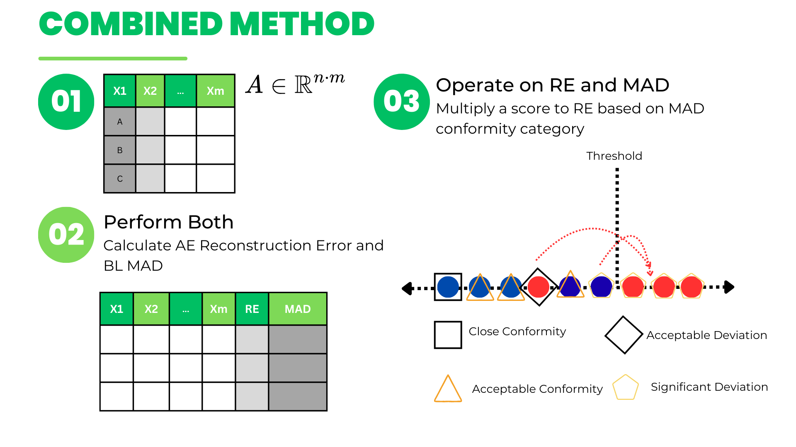

# Combined Autoencoder and Benford's First Digit Analysis Approach for Anomaly Detection in Accounting Journal Entry Data

## Project Participants
| Student ID     | Name                     | University                         | Department |
|----------------|--------------------------|------------------------------------|------------|
| 12030121120034 | Muhammad Dzaki Al Aqsha  | Universitas Diponegoro             | Accounting |

## Project Overview
This project was developed as part of an **undergraduate thesis (skripsi)** to fulfill the graduation requirements for a bachelor's degree. The research aims to develop and introduce a novel anomaly detection procedure on accounting journal entry data by combining autoencoder and Benford's first digit analysis.

This project is greatly inspired by the [work](https://github.com/GitiHubi/deepAI) of Marco Schreyer and Timur Sattarov, as well as the works of Mark Nigrini.

## Approach Overview
### Baseline Autoencoder Implementation

### Baseline Benford's First Digit Analysis for Anomaly Detection

### Proposed Combined Method

## Result Overview (Not Finished)
| Anomaly Detection Method | Sub-Sample Method | Sub-Sample Size | Accuracy |
| ------------------------ | ----------------- | --------------- | ----------- |
| Autoencoder              | Distribution Preserving Stratified Random Sampling | 100042 entries | 99.95% |
