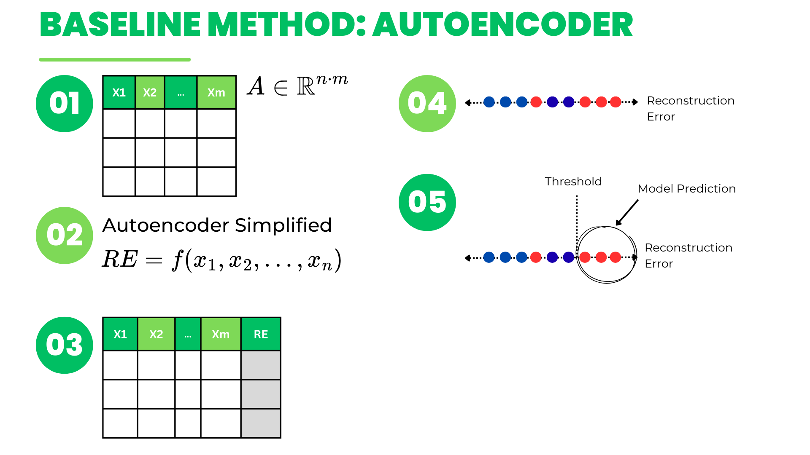
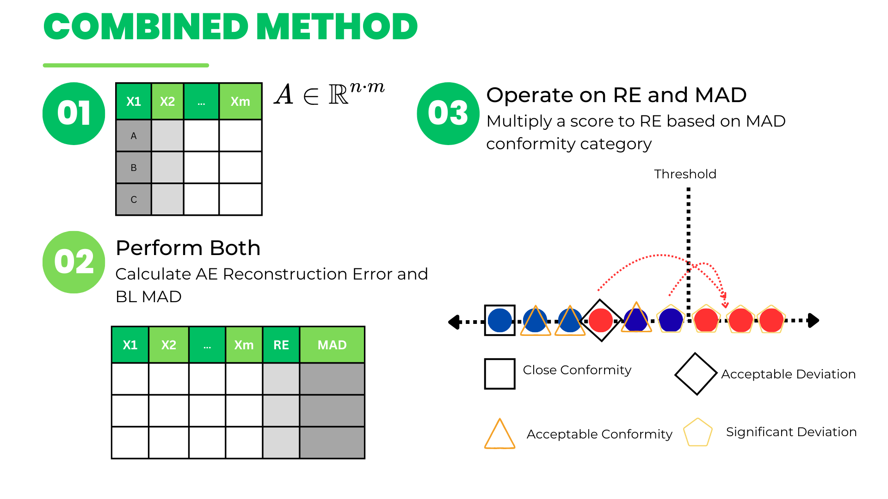
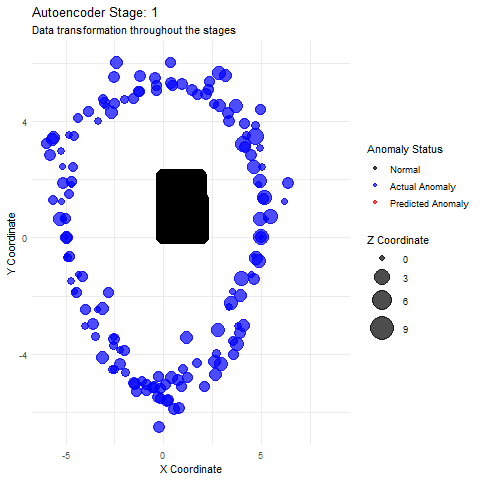

# Combined Autoencoder and Benford's First Digit Analysis Approach for Anomaly Detection in Accounting Journal Entry Data

## Project Participants
| Student ID     | Name                             | University                         | Department | Role                      |
|----------------|--------------------------------- |------------------------------------|------------| ------------------------- |
| 12030121120034 | Muhammad Dzaki Al Aqsha          | Universitas Diponegoro             | Accounting | First Author              |
|                | Adi Firman Ramadhan, S.E., M.Ak. | Universitas Diponegoro             | Accounting | Second Author, Supervisor |

## Project Overview
Currently a work-in-progress, this project aims to introduce a novel approach for accounting journal entry red flag test by combining autoencoder neural network and Benford's law first digit analysis on a data of 500,000+ transactions from a pseudonymized real life entity's SAP system's BKPF and BSEG table. 

Achieved 99% accuracy, 92% precision, 80% recall, and 86% F1-Score. 

The novel approach introduces a new heuristical multiplier mechanism on autoencoder reconstruction error to elevate below-threshold observations satisfying multiperspective criteria based on adjacency and Benford's law conformity in order to increase recall from baseline autoencoder method. As well as introducing a new Benford's law distribution preserving stratified sampling method. This project is conducted as part of a graduation final year thesis project for a bachelor's degree in accounting. This project is greatly inspired by the [works](https://github.com/GitiHubi/deepAI) of Marco Schreyer, et al. in autoencoder implementation for accounting as well as Mark Nigrini's works on Benford's digit analysis in accounting.

## Approach Overview
### Baseline Autoencoder Implementation

### Baseline Benford's First Digit Analysis for Anomaly Detection

### Proposed Combined Method

### Autoencoder Visualization Using Synthetic Data

#### Stages Explanation

1. Stage 1: Original Representation (Input Layer with original anomaly labeling)
2. Stage 2: Latent Space Representation (with original anomaly labeling)
3. Stage 3: Reconstructed Representation (Output Layer with original anomaly labeling)
4. Stage 4: Univariate Reconstruction Error MSE Span (calculated from the discrepancy between original and reconstructed representation, color-coded using the original anomaly labeling)
5. Stage 5: Univariate Reconstruction Error MSE Span (with predicted anomaly labeling, flags for observations with MSE value larger than a chosen n percentile)
6. Stage 6: Original Representation with predicted anomaly labeling

## Result Overview
| Anomaly Detection Method | Sub-Sample Method | Sub-Sample Size | Accuracy | Precision | Recall | F1-Score |
| ------------------------ | ----------------- | --------------- | ----------- | ----------- | ----------- | ----------- |
| Autoencoder | Distribution Preserving Stratified Random Sampling | 100,042 entries | 99.96% | 93.33% | 80.46% | 86.42% |
| Benford's Analysis | Full Data | 533,009 entries | 99.99% | 100% | 70% | 82.35% |
| Combined Approach | Distribution Preserving Stratified Random Sampling | 100,042 entries | 99.96% | 92.72% | 80.46% | 86.15% |
